BiomeHorizon is an R package for visualizing longitudinal microbiome data in the form of a horizon plot. A horizon plot provides a compact way to visualize multiple time series in parallel by overlying the values at different ranges of magnitude. Though this package is designed for microbiome data, it can be used to visualize other types of longitudinal data as well.

In this tutorial, we walk through creating a horizon plot from sample data, and then add several modifications to the visualization to demonstrate the versatility of the package. We use a sample OTU table with 8814 OTUs and 1781 samples from six individuals, a metadata table with collection dates, and a table with taxonomy information. Samples in the OTU table were collected at irregular time intervals over a period of several years, and each subject has a different number of samples.  


### Loading in the package

The sample data sets and dependencies are loaded automatically on download, so we just need to install and load in the package.

```
## Install devtools
install.packages("devtools")

devtools::install_github("isaacfink21/biomehorizon")
library(biomehorizon)  
```  


### Preview of Sample Data

```
## OTU table format. The first column contains OTU IDs, and all other columns are samples, as well as
## two blanks which are filtered out automatically before analysis. 
## Values represent sample reads per OTU within a given sample. 
## Though in this case values are integer sample reads, they can also be represented as proportions or 
## percentages of the total sample.
otusample %>% 
	arrange(desc(sample_1)) %>% 
	select(1:7) %>% 
	head()
```

```
     otuid sample_1 sample_2 sample_3 sample_4 sample_5 sample_6
1 otu_2457     2338      362     2011      223       89      617
2 otu_2354     1369      276        0       59      108       33
3 otu_2526     1264      630      570      234      107      255
4 otu_2478     1134        0        0        2        0        0
5 otu_7662     1108       46       36        0       33        0
6 otu_5723     1070       98        0        0        0        0
```

```
## Metadata format. Contains sample IDs matching the column names of otusample, 
## subject IDs, and collection dates.
head(metadatasample)
```

```
     sample   subject collection_date
1  sample_1 subject_1      2001-12-27
2  sample_2 subject_2      2006-11-01
3  sample_4 subject_3      2006-11-01
4  sample_6 subject_4      2005-09-21
5  sample_9 subject_5      2005-09-22
6 sample_10 subject_6      2005-09-23
```

```
## Taxonomydata format. Describes taxonomy of each OTU from Kingdom through Genus.
## Levels without classification have NA values.
## You can also supply a vector of strings each with the entire taxonomy of an OTU, 
## with levels separated by semicolons
## Supports classification up to Subspecies (8 levels)
head(taxonomydata)
```

```
     otuid  Kingdom           Phylum               Class            Order            Family
1   otu_10 Bacteria       Firmicutes          Clostridia    Clostridiales    Peptococcaceae
2  otu_100 Bacteria       Firmicutes          Clostridia    Clostridiales   Ruminococcaceae
3 otu_1000 Bacteria Gemmatimonadetes       Longimicrobia Longimicrobiales Longimicrobiaceae
4 otu_1001 Bacteria Gemmatimonadetes       Longimicrobia Longimicrobiales Longimicrobiaceae
5 otu_1002 Bacteria   Proteobacteria Deltaproteobacteria          RCP2-54              <NA>
6 otu_1003 Bacteria   Proteobacteria Deltaproteobacteria          RCP2-54              <NA>
            Genus
1     Peptococcus
2 Subdoligranulum
3            <NA>
4            <NA>
5            <NA>
6            <NA>  
```  


### Data Refining and OTU Selection

Before we visualize the data using the main function, we must first prepare the data sets and other variables for analysis using the `prepanel` function. This will do several things, most importantly:

1. Filter OTUs
2. Filter samples to just one subject
3. Convert values to percentages, if they are not already in that format
4. Check format of data sets
5. Check for and catch common user errors

Then, it will output the refined arguments in a list that can be supplied to the main function.

You can use this function with just an OTU table, but this will assume that all samples come from the same subject. Since *otusample* has 6 subjects, we will need to provide additional metadata matching samples to their subjects. Our metadata also contains collection dates for each sample, which will allow us to ensure samples are ordered chronologically.

Let's select "subject_1".

```
paramList <- prepanel(otudata = otusample, metadata = metadatasample, subj = "subject_1") 
```

```
Constructed an OTU table and other variables with the following settings:
thresh_prevalence: 80
thresh_abundance: 0.5
thresh_NA: 5
subj: subject_1

23 OTUs met the filtering requirements, with the following stats:
     OTU_ID Average_abundance Prevalence Num_missing_samples
1   otu_121         0.5519409   97.53086                   0
2  otu_1243        14.2142798  100.00000                   0
3  otu_1530         4.1532489   97.53086                   0
4   otu_203         1.2380556   88.88889                   0
5  otu_2378         1.5814103   96.29630                   0
6  otu_2404         0.5103419   96.29630                   0
7  otu_2457         2.1052263  100.00000                   0
8  otu_2487         0.9898039   83.95062                   0
9  otu_2514         1.0179452   90.12346                   0
10 otu_2526         2.6775325   95.06173                   0
11 otu_2552         0.9270476   86.41975                   0
12 otu_3131         0.9506667   86.41975                   0
13 otu_3136         0.7341905   86.41975                   0
14 otu_3773         2.7263786  100.00000                   0
15 otu_4252         0.5308205   80.24691                   0
16 otu_6205         1.0759167   98.76543                   0
17 otu_6570         0.8166255  100.00000                   0
18 otu_6789         0.7530348   82.71605                   0
19 otu_6821        17.4279835  100.00000                   0
20 otu_6837         0.9456219   82.71605                   0
21 otu_7644         1.5073134   82.71605                   0
22 otu_7737         2.2286250   98.76543                   0
23 otu_8547         0.9883556   92.59259                   0
`biomehorizonpkg_otu_stats` was outputted to the environment.
```

Great. Now you should see in the console, the function selected several OTUs considered the most "important". By default, this is done using four filtering standards.

- **thresh_prevalence**: How many samples in this OTU contain at least one sample read that maps to this OTU?
- **thresh_abundance**: Out of the samples that contain reads for this OTU, what was the average abundance of this OTU? i.e., what percentage of total reads in the sample are from this OTU?
- **thresh_abundance_override**: The same measurement as *thresh_abundance*, but if this higher threshold is reached, it overrides all other standards and the OTU is included.
- **thresh_NA**: This sets the maximum allowed percentage of samples with missing data (NA) for this OTU.

As an example, *otu_4252* appears in 65/81 samples, giving it a "prevalence score" of ~80.25%. Out of the 65 samples with at least one read, the average proportion of total reads is ~.0053, giving it an "abundance score" of ~0.53%. This meets the default standards of 80% prevalence and 0.5% abundance, so the OTU is included.

```
library(dplyr)
## Retrieve samples from subject_1
otusample_subj1 <- otusample %>% 
	select(otuid, as.character((metadatasample %>% filter(subject=="subject_1"))$sample))

## Samples reads for otu_4252
otusample_subj1 %>% 
	filter(otuid == "otu_4252") %>% 
	select(-otuid) %>% 
	as.numeric()
```

` [1]   `**`0`**`  35   `**`0`**`   `**`0`**`  17   `**`0`**`  21  11   `**`0`**` 207 595 570  43  56 138   `**`0`**`  13   `**`0`**` 464   5   `**`0`**` 701 217 101 14 859 `**`0`**`

`[28]  26   `**`0`**`   6 337  22 258 217   6 321  71  25  77   `**`0`**` 164  39 128  60 205 595  42 190 181  21  47   7 217 182`  

`[55] 23 165 540  71   `**`0`**`  88  68  64   7   `**`0`**`  11   `**`0`**`  67  39  11  45   `**`0`**` 570 `**`0`**`  46 243  70  14 182 354  88  74`

These 23 OTUs were selected using the default filtering thresholds, but maybe we want stricter standards.

```
paramList <- prepanel(otudata = otusample, metadata = metadatasample, subj = "subject_1", 
thresh_prevalence = 90, thresh_abundance = 1.5)
```

```
Constructed an OTU table and other variables with the following settings:
thresh_prevalence: 90
thresh_abundance: 1.5
thresh_NA: 5
subj: subject_1

8 OTUs met the filtering requirements, with the following stats:
    OTU_ID Average_abundance Prevalence Num_missing_samples
1 otu_1243         14.214280  100.00000                   0
2 otu_1530          4.153249   97.53086                   0
3 otu_2378          1.581410   96.29630                   0
4 otu_2457          2.105226  100.00000                   0
5 otu_2526          2.677532   95.06173                   0
6 otu_3773          2.726379  100.00000                   0
7 otu_6821         17.427984  100.00000                   0
8 otu_7737          2.228625   98.76543                   0
`biomehorizonpkg_otu_stats` was outputted to the environment.
```

Alternatively, we can manually select OTUs.

```
paramList <- prepanel(otudata = otusample, metadata = metadatasample, subj = "subject_1", 
otulist = c("otu_1243", "otu_6821", "otu_2378", "otu_7737", "otu_1530", "otu_8547", "otu_6570", "otu_2552"))  
```  


### Constructing the Horizon Plot

After refining the data with `prepanel`, we supply the parameter list to `horizonplot` to construct the horizon plot.

```
## Basic plot using default filtering thresholds
paramList <- prepanel(otudata = otusample, metadata = metadatasample, subj = "subject_1")
paramList[[1]] <- paramList[[1]][,1:21]

horizonplot(paramList)

## Select OTUs manually
paramList <- prepanel(otudata = otusample, metadata = metadatasample, subj = "subject_1", otulist = c("otu_6837", "otu_6821", "otu_6789", "otu_4252", "otu_2378", "otu_1243", "otu_3136", "otu_203", "otu_121",  "otu_3131", "otu_2404", "otu_2514", "otu_6570", "otu_2457", "otu_8547", "otu_1530", "otu_6205", "otu_7644", "otu_3773", "otu_2552", "otu_7737", "otu_2526", "otu_2487"))
paramList[[1]] <- paramList[[1]][,1:21]

horizonplot(paramList)
```

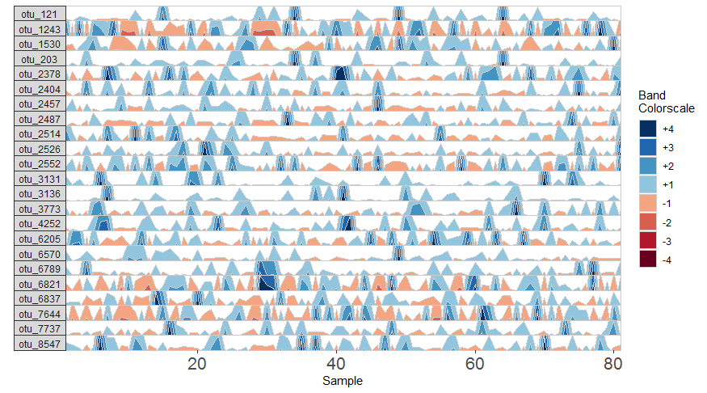

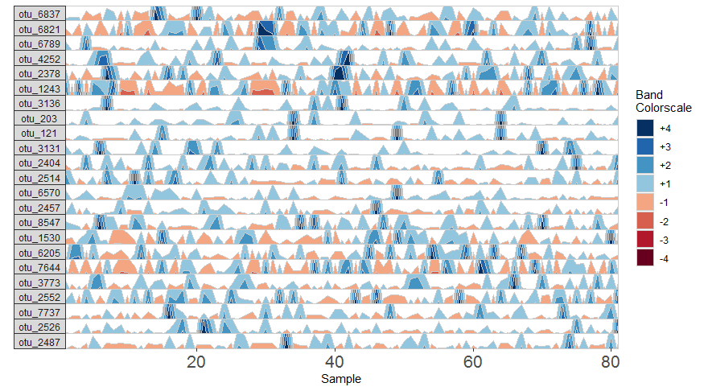

You'll notice that the plots above contain the same OTUs, but they are ordered differently. In the plot with manual selection, OTUs are arranged according to their order in otulist. If you want to arrange OTU panels in a specific order, you should use this vector.  


### Labelling OTU Facets

In addition to the default OTU ID labels for each OTU subplot, we can also label facets by their taxonomy. This method will display the most narrow level of classification available for each OTU as a facet label. To do this, we need to supply a third data set with taxonomy information, *taxonomysample*.

```
## Supply taxonomysample and set facetLabelsByTaxonomy to TRUE
paramList <- prepanel(otudata = otusample, metadata = metadatasample, taxonomydata = taxonomysample, subj = "subject_1", facetLabelsByTaxonomy = TRUE)

horizonplot(paramList)
```

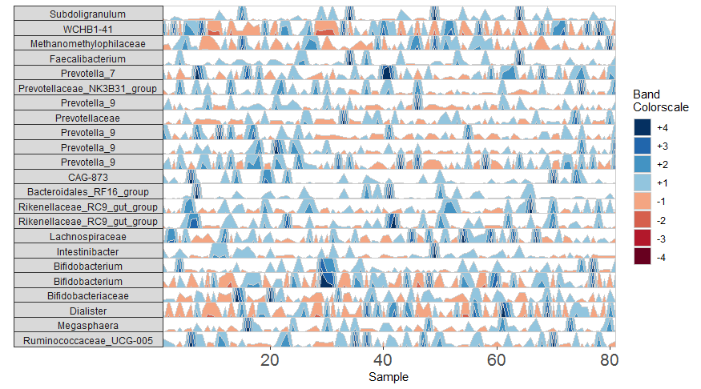

Alternatively, we can supply custom facet labels. These will be applied to facet subplots from top to bottom, in the order they are specified to the vector.

```
## Apply custom alphabetical facet labels
paramList <- prepanel(otudata = otusample, metadata = metadatasample, taxonomydata = taxonomysample, subj = "subject_1", customFacetLabels = LETTERS[1:23])

horizonplot(paramList)
```

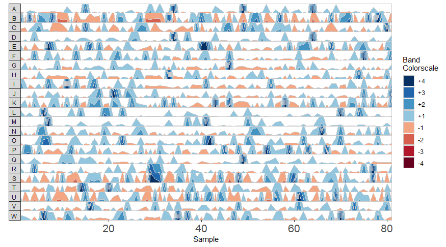  


### Plot a Single OTU Across Multiple Subjects

Rather than plotting one subject across multiple OTUs, we can also plot just one OTU to compare the same timepoint across multiple subjects. To use this setting, however, data must have the same number of samples with the same sequence of collection dates for all subjects. Since *otusample* does not satisfy these requirements, we create artifical data sets for this example by modifying *otusample* and *metadatasample*.  

```
## Create dummy datasets using the first 50 samples of each subject
## Since collection dates are inconsistent between subjects, we also create fake collection dates as 
## days 1 through 50.
library(dplyr)
dummyMetadata <- metadatasample %>% 
	group_by(subject) %>% 
	do(.[1:50,]) %>%
	mutate(collection_date = 1:50)
dummyOTU <- otusample %>% 
	select(otuid, as.character(dummyMetadata$sample))

## Single variable analysis with "otu_1243"
paramList <- prepanel(otudata = dummyOTU, metadata = dummyMetadata, singleVarOTU = "otu_1243")

horizonplot(paramList)

## Select a subset of all subjects and arrange facet order
paramList <- prepanel(otudata = dummyOTU, metadata = dummyMetadata, singleVarOTU = "otu_1243", subj = c("subject_2", "subject_1", "subject_3"))

horizonplot(paramList)
```

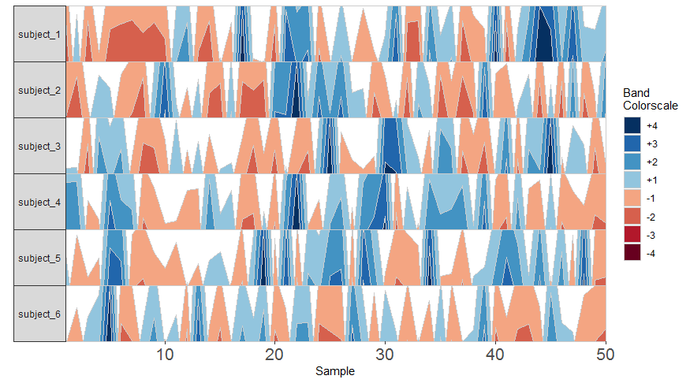

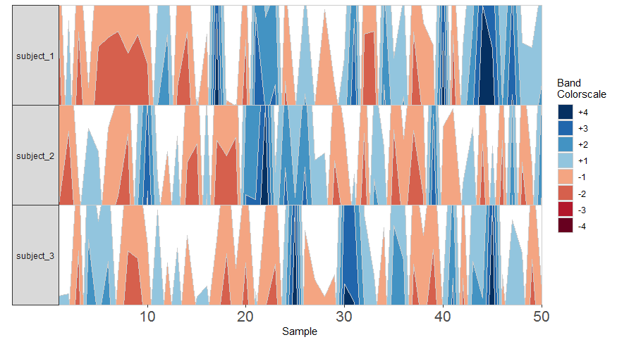

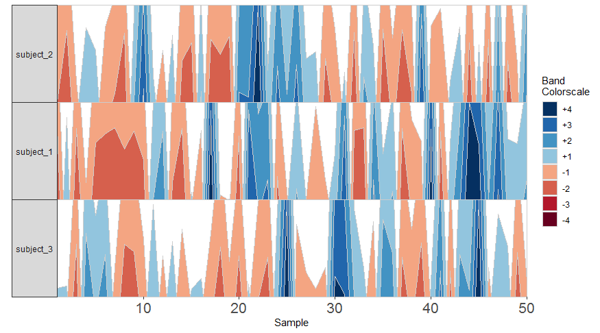

Based on this graph from artificial data we might then infer that subjects 1, 2 and 3 all have a decreased abundance of *otu_1243* at sample 7.  


### Additional Modifications of the Horizon Plot

The origin value of an OTU defines its baseline, i.e. the base of the first positive band, where value=0. By default, the origin for each OTU is calculated as the median value of that OTU across all samples, so blue bands reflect abundance above the median, while red bands indicate abundance below the median. 4 positive and 4 negative bands are used, where band widths represent quartiles above and below the median relative to the extreme value for that OTU. This means that by default, if across all samples the median relative abundance of otu_121 was 10%, the maximum relative abundance of otu_121 in any sample was 30%, and the minimum relative abundance was 0%, then each band colorscale represents an abundance range of ((30-10)/4) = 5%. Thus, a band colorscale value of +2 for otu_121 at timepoint x indicates that otu_121 had a relative abundance within (min = 10 + (30-10)/4, max = 10 + 2*((30-10)/4)) = 15-20% at timepoint x, while a band colorscale value of -2 for otu_121 at timepoint y indicates that otu_121 had a relative abundance ranging from 0-5% at timepoint y. Since the distance between the maximum and the origin (30-10% = 20%) is greater than the distance between the minimum and the origin (10-0% = 10%) for otu_121, there are no timepoints at a band colorscale of -3 or -4. By scaling within each OTU, the dynamics of multiple OTUs that may vary in median abundance by orders of magnitude can be visualized on the same graph. 

However, we can add several modifications to the horizon plot to emphasize different aspects of our longitudinal data.  

First, we change the number of positive bands into which data is segmented.

```
## Use three horizon bands 
paramList <- prepanel(otudata = otusample, metadata = metadatasample, subj = "subject_1", nbands = 3)

horizonplot(paramList)
```

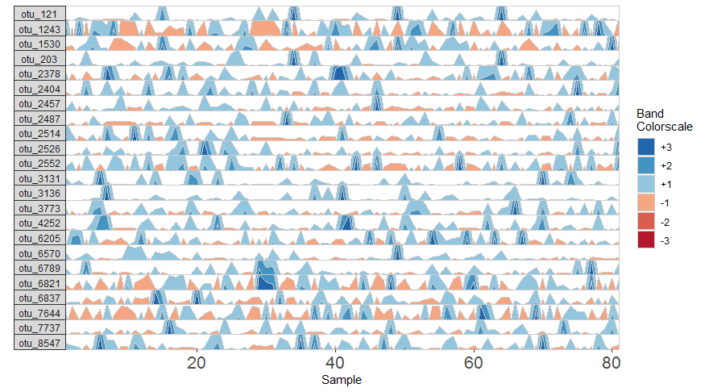

Including more horizon bands will more precisely distinguish values and emphasize those at the highest ranges of magnitude. Using less bands will de-emphasize values at the extreme ends of the data.

We can also change the origin, the value at which all sample values will be centered. We can supply this either as a constant, to set a fixed origin value for all OTUs, or as a function that operates on sample values, to evaluate a unique origin for each panel.

```
## Origin as the mean absolute deviation of sample values
paramList <- prepanel(otudata = otusample, metadata = metadatasample, subj = "subject_1", origin = function(y) { mad(y, na.rm = TRUE) })

horizonplot(paramList)
```

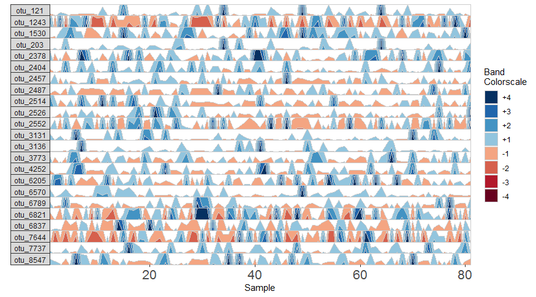


```
## Set a fixed origin of 1% for all OTU subpanels
paramList <- prepanel(otudata = otusample, metadata = metadatasample, subj = "subject_1", origin = 1)
horizonplot(paramList)
```

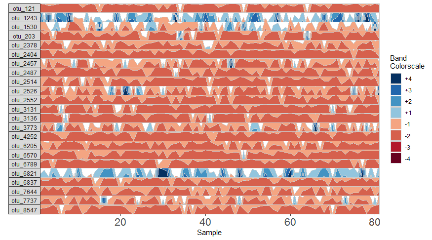

Similarly, we can modify the band thickness, the height of each horizontal band denoted by a unique color, which determines the scale of a horizon subplot.

```
## Set band thickness to 1/6 the distance between the origin and maximum value
paramList <- prepanel(otudata = otusample, metadata = metadatasample, subj = "subject_1", band.thickness = function(y) {max((abs(y - origin(y))), na.rm=TRUE) / 6})

horizonplot(paramList)
```

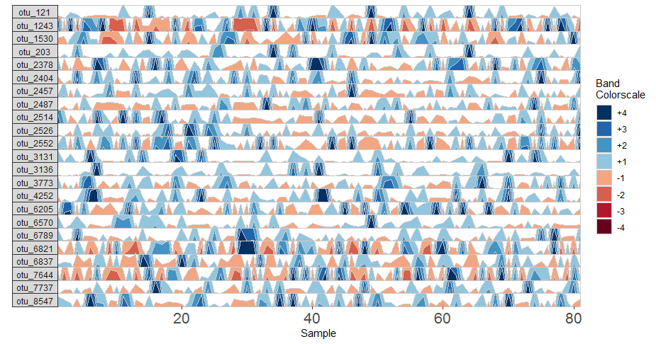

Here, since the top of the highest band is only 4/6 of the maximum value, this becomes the new maximum and all higher values are rounded down. The same is true for negative bands. This can be valuable for de-emphasizing outliers at the extrema of the data.

```
## Fixed band thickness of 10%
paramList <- prepanel(otudata = otusample, metadata = metadatasample, subj = "subject_1", band.thickness = 0.2)

horizonplot(paramList)
```

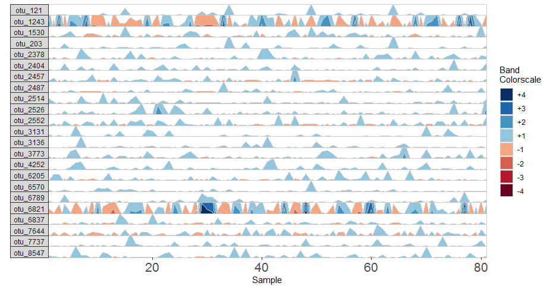

```
## Fixed band thickness of 2%
paramList <- prepanel(otudata = otusample, metadata = metadatasample, subj = "subject_1", band.thickness = 2)

horizonplot(paramList)
```

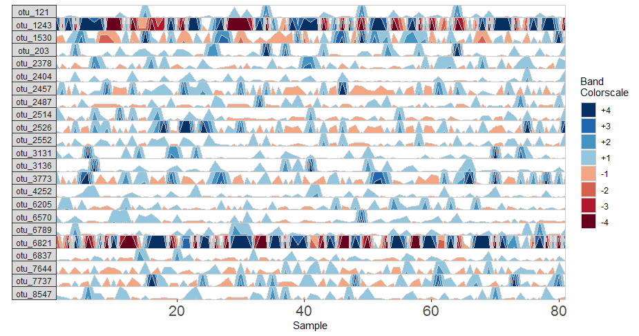

```
## Fixed band thickness of 0.2%
paramList <- prepanel(otudata = otusample, metadata = metadatasample, subj = "subject_1", band.thickness = 0.2)

horizonplot(paramList)
```

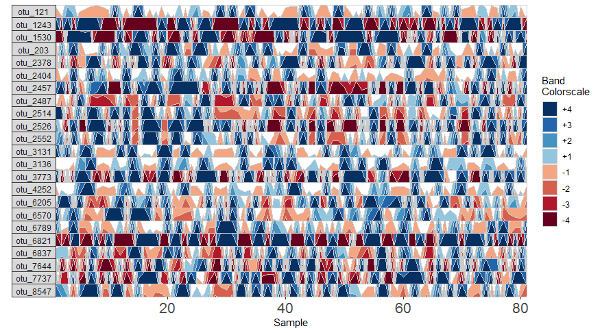

Notice that at smaller values of band.thickness, an increasing number of values are above the new maximum or below the new minimum, resulting in more extreme bands (at +4 or -4).

```
## Fixed origin AND fixed band thickness
paramList <- prepanel(otudata = otusample, metadata = metadatasample, subj = "subject_1", origin = 1, band.thickness = 1)

horizonplot(paramList)
```

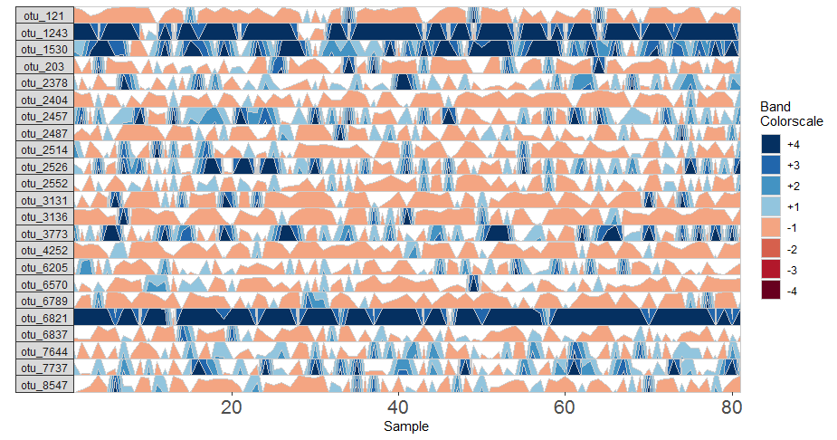
 
Setting a fixed origin *and* band thickness lets us compare values between facets. For example, in nearly all samples, *otu_6821* is more abundant than *otu_6789*. We can't say this about a plot with a variable origin, as values are not centered to the same zero. Similarly, a variable band thickness means the distance of a positive value from the origin is not consistent between subplots.  


### Dealing with Irregularly Spaced Data

Since *otusample* is irregularly spaced, i.e. the distance of time between samples is not consistent throughout the time series, the timescale on the plot is misleading. To deal with this issue, the package offers tools to transform the data into a regularly spaced time series. To do this, we specify an interval of time at which to interpolate new data. Let's create a new time point every 100 days, i.e. at days 1, 101, 201, 301, ... , 3301.

```
## Adjust data to a regular time interval of 100 days
paramList <- prepanel(otusample, metadatasample, subj = "subject_2", regularInterval = 100)
```

We can see the sample collection days starting from day 1 by viewing the `timestamps` variable from the output list of prepanel. This is the third element of the list (you can view components of the list in the horizonplot function documentation).

```
paramList[[3]]
```

```
  [1]    1   68  261  391  486  514  517  523  526  529  531  535  542  563  570  618  638  640  668
 [20]  675  697  796  800  858  872  879  883  885 1032 1052 1056 1056 1059 1108 1195 1206 1223 1439
 [39] 1454 1593 1595 1613 1648 1674 1682 1705 1709 1720 1824 1892 1894 1966 1980 1985 1989 2089 2116
 [58] 2253 2259 2306 2321 2322 2332 2461 2508 2524 2552 2601 2624 2672 2680 2692 2694 2748 2750 2771
 [77] 2774 2778 2783 2799 2805 2810 2824 2844 2885 2932 2961 2965 2969 2991 3015 3019 3021 3049 3053
 [96] 3055 3057 3071 3119 3137 3144 3147
```

Each new value will be linear interpolated from the previous and subsequent timepoints in `timestamps`. We can then plot the regularly spaced data, and get a graph with an accurate timescale.

```
horizonplot(paramList)
```

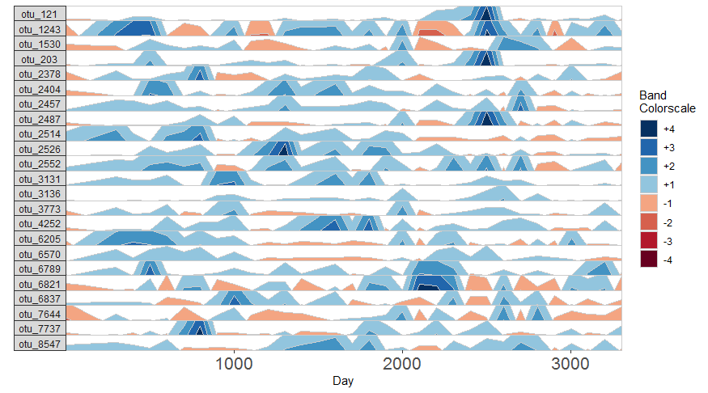

While this timescale is more accurate than simply plotting samples next to each other, it also introduces inaccuracy by interpolating across large timespans. Since our data contains large gaps in time between samples, regularizing data in this way could be misleading. We can reduce this inaccuracy by specifying the maximum amount of time without samples allowed to create an interpolated timepoint. 

For this example, a new timepoint will be interpolated at day 1401. The closest previous timepoint is day 1223, and the closest subsequent timepoint is day 1439, giving a distance of 178 days from the furthest adjacent timepoint. If we set the maximum gap to 150 days, for example, then the timepoint at 1401 will not be created. Instead, it will produce a break in the time axis, and data will be regularized separately on both sides of the break. This break is simulated by splitting the plot into two facets.

```
## Set maxGap to 150
paramList <- prepanel(otusample, metadatasample, subj = "subject_2", regularInterval = 100, maxGap = 150)

horizonplot(paramList)
```

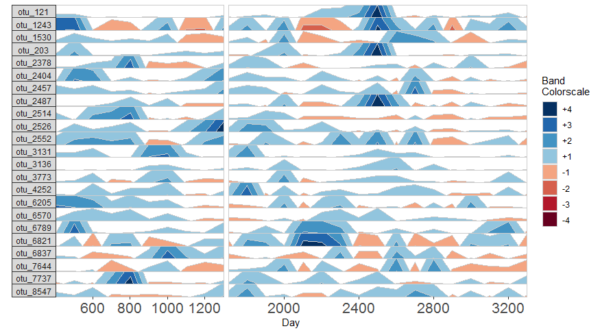

If many breaks in the time axis are created, this could result in facets with very few samples. For example, if maxGap = 200 and the first two samples are at days 1 and 323, the first facet would contain only one sample (day 1). You can set the minimum number of samples required to include a facet (default = 2 samples).

```
## Create a plot from subject 2
paramList <- prepanel(otusample, metadatasample, subj = "subject_2", regularInterval = 50, maxGap = 100)

horizonplot(paramList)
```

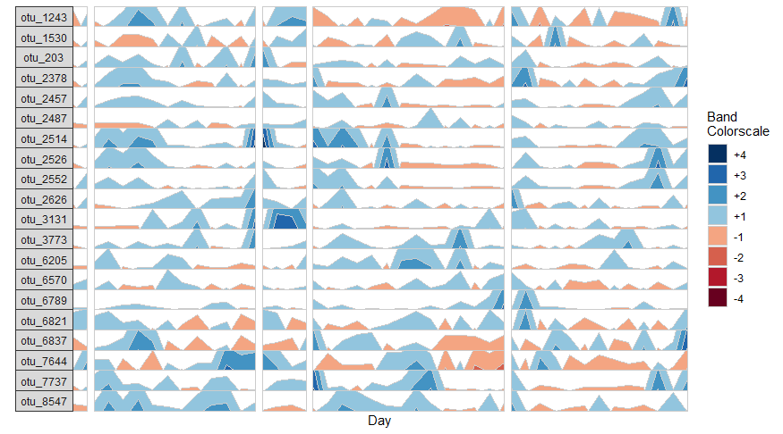

```
## Remove facets with <5 samples
paramList <- prepanel(otusample, metadatasample, subj = "subject_2", regularInterval = 50, maxGap = 100, minSamplesPerFacet = 5)

horizonplot(paramList)
```

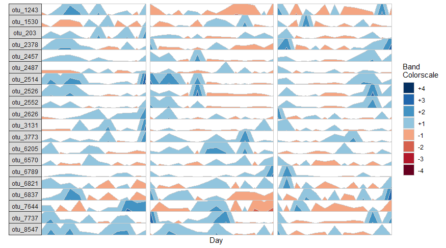

You should note that removing facets can often result in a timescale that does not start at day 1! The plot for maxGap = 200, for example, starts at day 401, as days 1, 101, 201 and 301 were removed.  


### Adding Custom Aesthetics

We can further customize the horizon plot by supplementing a list of aesthetics to the horizonplot() function. We obtain this list by calling the horizonaes() function with the custom aesthetics to override default values. If no custom aesthetics are specified to horizonplot(), default aesthetics will be retrieved by calling horizonaes() with no arguments.

```
paramList <- prepanel(otusample, metadatasample, subj = "subject_1")

## Add a title, remove color legend and override the x-label
horizonplot(paramList, aesthetics = horizonaes(title = "Microbiome Horizon Plot", xlabel = "Subject 1 Sample", showColorLegend = FALSE))
```

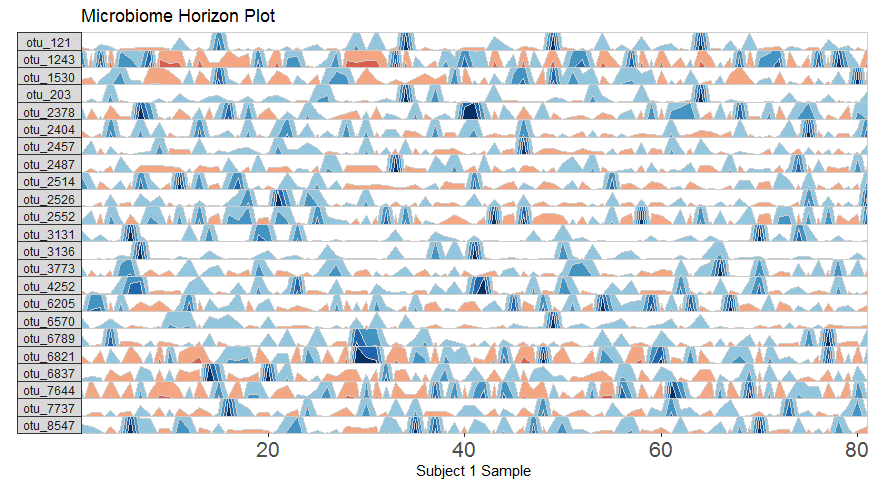

```
## Remove a default aesthetic by setting it to NULL
horizonplot(paramList, aesthetics = horizonaes(xlabel = NULL))
```

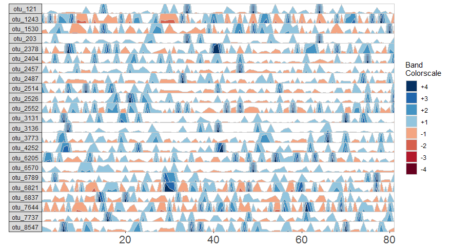

We can supply a new color scale for horizon bands as a vector of hexadecimal color codes ordered from the most negative to the most positive band. This will work as long as the length of the vector is equal to 2 * nbands (the number of positive bands, specified in prepanel).

```
## Supply custom color scale of length 8
library(RColorBrewer)
horizonplot(paramList, aesthetics = horizonaes(col.bands = brewer.pal(8, "PiYG")))
```

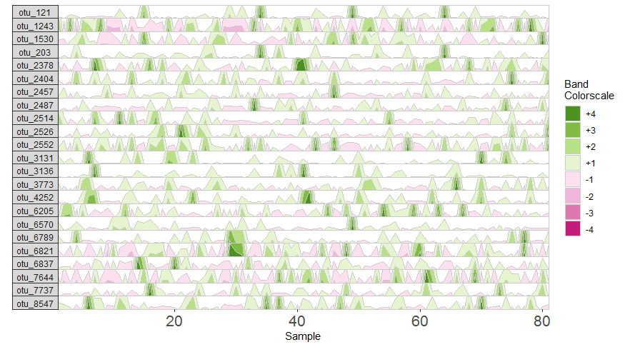

Most commonly relevant aesthetics are returned by horizonaes(), but if we want to add other aesthetics not included in this function, we can manually append them to the horizon plot object.

```
## Add a gray plotting area background
horizonplot(paramList, aesthetics = horizonaes(col.bands = brewer.pal(10, "PiYG")[c(1:4,7:10)])) + 
ggplot2::theme(panel.background = ggplot2::element_rect(fill = "gray92"))
```

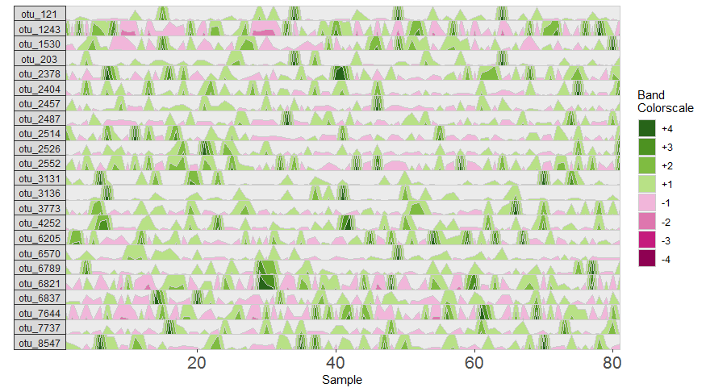
