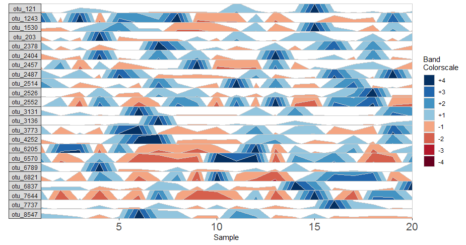
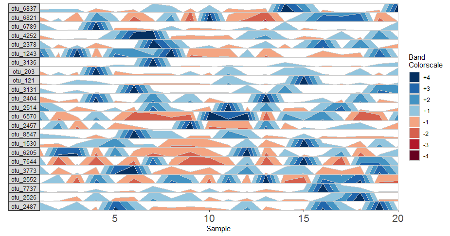
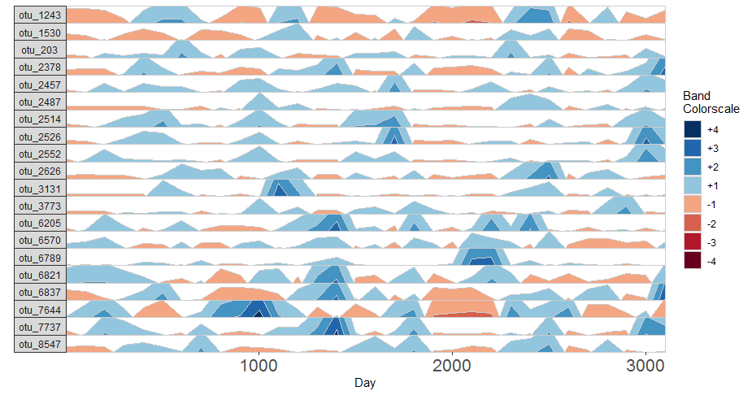
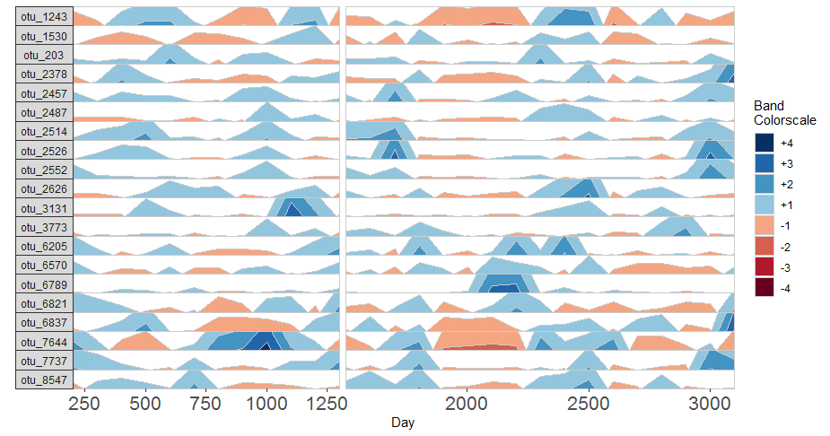
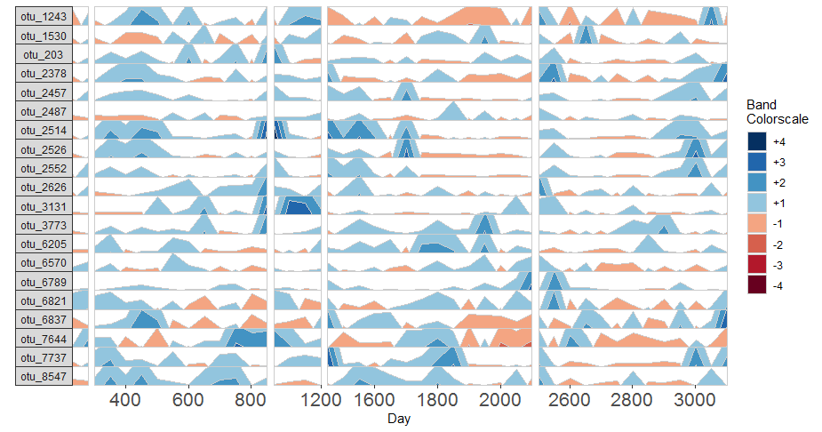
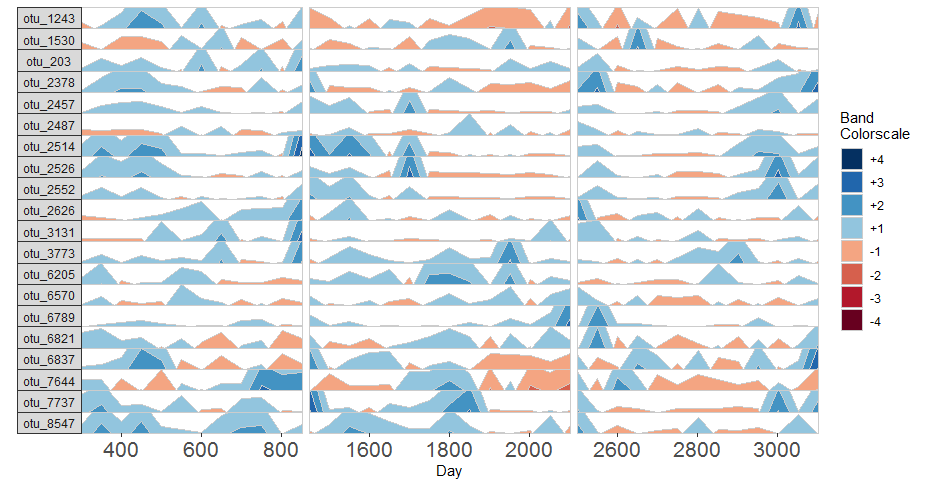

BiomeHorizon is an R package for visualizing longitudinal microbiome data in the form of a horizon plot. A horizon plot provides a compact way to visualize multiple time series in parallel by overlying the values at different ranges of magnitude. Though this package is designed for microbiome data, it can be used to visualize other types of longitudinal data as well.

In this tutorial, we walk through creating a horizon plot from sample data, and then add several modifications to the visualization to demonstrate the versatility of the package. We use a sample OTU table with 8814 OTUs and 1781 samples from six individuals, a metadata table with collection dates, and a table with taxonomy information. Samples in this data set are collected at irregular time intervals over a period of several years, with a different number of samples for each subject.

### Loading in the package

The sample data sets and dependencies are loaded automatically on download, so we just need to install and load in the package.

```
## Install devtools if you don't already have the package
install.packages("devtools")

devtools::install_github("isaacfink21/biomehorizon")
library(biomehorizon)
```

### Preview of Sample Data

```
## OTU Table format. The first column contains OTU IDs, and all other columns are samples. 
## Values represent sample reads per OTU within a given sample. 
## Though in this case values are integer sample reads, they can also be represented as proportions or 
## percentages of the total sample.
otusample %>% 
	arrange(desc(sample_11406_0024_S24_L001)) %>% 
	select(1:6) %>% 
	head()
```

```
     otuid sample_11406_0024_S24_L001 sample_11406_0028_S28_L001 sample_11406_0029_S29_L001
1 otu_2457                       2338                        362                       2011
2 otu_2354                       1369                        276                          0
3 otu_2526                       1264                        630                        570
4 otu_2478                       1134                          0                          0
5 otu_7662                       1108                         46                         36
6 otu_5723                       1070                         98                          0
  sample_11406_0030_S30_L001 sample_11406_0033_S33_L001
1                        223                         89
2                         59                        108
3                        234                        107
4                          2                          0
5                          0                         33
6                          0                          0
```

```
## Metadata format. Contains sample IDs matching the column names of otusample, 
## subject IDs, and collection dates.
head(metadatasample, 10)
```

```
                      sample   subject collection_date
1 sample_11406_0024_S24_L001 subject_1      2001-12-27
2 sample_11406_0028_S28_L001 subject_2      2006-11-01
3 sample_11406_0030_S30_L001 subject_3      2006-11-01
4 sample_11406_0038_S38_L001 subject_4      2005-09-21
5 sample_11406_0045_S45_L001 subject_5      2005-09-22
6 sample_11406_0048_S48_L001 subject_6      2005-09-23
```

```
## Taxonomydata format. Describes taxonomy of each OTU from Kingdom through Genus.
## Levels without classification have NA values.
head(taxonomydata)
```

```
     otuid  Kingdom           Phylum               Class            Order            Family
1   otu_10 Bacteria       Firmicutes          Clostridia    Clostridiales    Peptococcaceae
2  otu_100 Bacteria       Firmicutes          Clostridia    Clostridiales   Ruminococcaceae
3 otu_1000 Bacteria Gemmatimonadetes       Longimicrobia Longimicrobiales Longimicrobiaceae
4 otu_1001 Bacteria Gemmatimonadetes       Longimicrobia Longimicrobiales Longimicrobiaceae
5 otu_1002 Bacteria   Proteobacteria Deltaproteobacteria          RCP2-54              <NA>
6 otu_1003 Bacteria   Proteobacteria Deltaproteobacteria          RCP2-54              <NA>
            Genus
1     Peptococcus
2 Subdoligranulum
3            <NA>
4            <NA>
5            <NA>
6            <NA>
```

### Data Refining and OTU Selection


### Constructing the Horizon Plot

After refining the data with prepanel, we supply the parameter list to horizonplot to construct the horizon plot.

```
## Basic plot using default filtering thresholds
paramList <- prepanel(otudata = otusample, metadata = metadatasample, subj = "subject_1")

horizonplot(paramList)

## Select OTUs manually
paramList <- prepanel(otudata = otusample, metadata = metadatasample, subj = "subject_1", otulist = c("otu_6837", "otu_6821", "otu_6789", "otu_4252", "otu_2378", "otu_1243", "otu_3136", "otu_203", "otu_121",  "otu_3131", "otu_2404", "otu_2514", "otu_6570", "otu_2457", "otu_8547", "otu_1530", "otu_6205", "otu_7644", "otu_3773", "otu_2552", "otu_7737", "otu_2526", "otu_2487"))

horizonplot(paramList)
```





You’ll notice that the plots above contain the same OTUs, but they are ordered differently. In the plot with manual selection, OTUs are arranged according to their order in otulist. If you want to arrange OTU panels in a specific order, you should use this vector. 

### Labelling OTU Facets

In addition to the default OTU ID labels for each OTU subplot, we can also label facets by their taxonomy. This method will display the most narrow level of classification available for each OTU as a facet label. To do this, we need to supply a third data set with taxonomy information, taxonomysample.

```
## Supply taxonomysample and set facetLabelsByTaxonomy to TRUE
paramList <- prepanel(otudata = otusample, metadata = metadatasample, taxonomydata = taxonomysample, subj = "subject_1", facetLabelsByTaxonomy = TRUE)

horizonplot(paramList)
```


Alternatively, we can supply custom facet labels. These will be applied to facet subplots from top to bottom, in the order they are specified to the vector.

```
## Apply custom alphabetical facet labels
paramList <- prepanel(otudata = otusample, metadata = metadatasample, taxonomydata = taxonomysample, subj = "subject_1", customFacetLabels = LETTERS[1:23])

horizonplot(paramList)
```


### Plot a Single OTU Across Multiple Subjects

Rather than plotting with one subject and multiple OTUs, we can plot with one OTU and multiple subjects. This allows you to compare the same time point across multiple subjects. However, this requires the dataset to have the same number of samples for each subject, and the same sequence of collection dates between subjects. Since *otusample* does not satisfy these requirements, we’ll have to use a different data set for this example. For the sake of the example, let’s just modify *otusample*.

```
## Create dummy datasets using the first 50 samples of each subject
## Since collection dates are inconsistent between subjects, we also ## create fake collection dates as days 1 through 50.
library(dplyr)
dummyMetadata <- metadatasample %>% 
group_by(subject) %>% 
do(.[1:50,]) %>%
mutate(collection_date = 1:50)
dummyOTU <- otusample %>% select(otuid, as.character(dummyMetadata$sample))

## Single variable analysis with "otu_1243"
paramList <- prepanel(otudata = dummyOTU, metadata = dummyMetadata, singleVarOTU = "otu_1243")

horizonplot(paramList)

## Select a subset of all subjects
paramList <- prepanel(otudata = dummyOTU, metadata = dummyMetadata, singleVarOTU = "otu_1243", subj = c("subject_1", "subject_2", "subject_3"))

horizonplot(paramList)

## Subject facets will be arranged according to the order specified to `subj`
paramList <- prepanel(otudata = dummyOTU, metadata = dummyMetadata, singleVarOTU = "otu_1243", subj = c("subject_2", "subject_1", "subject_3"))

horizonplot(paramList)
```


Based on this graph from artificial data we might then infer that subjects 1, 2 and 3 all have a decreased abundance of otu_1243 around day 7.

### Additional Modifications of the Horizon Plot

We can add several modifications to the horizon plot to emphasize different aspects of our longitudinal data. 

First, we change the number of positive bands that data are segmented into.

```
## Use three horizon bands 
paramList <- prepanel(otudata = otusample, metadata = metadatasample, subj = "subject_1", nbands = 3)

horizonplot(paramList)
```


We can also change the origin value, which defines the baseline (i.e. value=0, the base of the first positive band) of horizon subplots. The sample values for each OTU will then be centered to this origin. We can supply this either as a constant, to set a fixed origin value for all OTUs, or as a function that operates on sample values, to evaluate a unique origin for each panel.

```
## Origin as the mean absolute deviation of sample values
paramList <- prepanel(otudata = otusample, metadata = metadatasample, subj = "subject_1", origin = function(y) { mad(y, na.rm = TRUE) })

horizonplot(paramList)
```


```
## Set a fixed origin of 5% for all OTU subpanels
paramList <- prepanel(otudata = otusample, metadata = metadatasample, subj = "subject_1", origin = 5)
horizonplot(paramList)
```

plot_origin_fixed.png

By default, the origin is calculated as the median of all sample values, so areas in blue reflect abundance above the median, while areas in red indicate abundance below the median.

Similarly, we can modify the band thickness, the height of each horizontal band denoted by a unique color, which determines the scale of a horizon subplot.

```
## Set band thickness to 1/6 the distance between the origin 
## and maximum value
paramList <- prepanel(otudata = otusample, metadata = metadatasample, subj = "subject_1", band.thickness = function(y) {max((abs(y - origin(y))), na.rm=TRUE) / 6})

horizonplot(paramList)
```

(assets/pics/plot_bt.png)

Here, since the top of the highest band is only 4/6 of the maximum value, this becomes the new maximum and all higher values are rounded down. The same is true for negative bands.

```
## Fixed band thickness of 0.2 
paramList <- prepanel(otudata = otusample, metadata = metadatasample, subj = "subject_1", band.thickness = 0.2)

horizonplot(paramList)
```


Notice that at smaller values of band.thickness, an increasing number of values are above the new maximum or below the new minimum, resulting in more extreme bands (at +4 or -4).

```
## Fixed origin AND fixed band thickness
```

plot_origin_bt_fixed.png
 
Setting a fixed origin and band thickness lets us compare values between facets. For example, around day 5, otu_1243 is more abundant than otu_4252. We can’t say this about a plot with a variable origin, as values are not centered to the same zero. Similarly, a variable band thickness means the distance of a positive value from the origin is not consistent between subplots.

### Dealing with Irregularly Spaced Data

Since *otusample* is irregularly spaced, i.e. the distance of time between samples is not consistent throughout the time series, the timescale on the plot is misleading. To deal with this issue, the package offers tools to transform the data into a regularly spaced time series. To do this, we specify an interval of time at which to interpolate new data. Let’s create a new time point every 100 days, i.e. at days 1, 101, 201, 301, …, 3301.

```
## Adjust data to a regular time interval of 100 days
paramList <- prepanel(otusample, metadatasample, subj = "subject_1", regularInterval = 100)
```

We can see the sample collection days starting from day 1 by viewing the `timestamps` variable from the output list of prepanel. This is the third element of the list (you can view components of the list in the horizonplot function documentation).

```
paramList[[3]]
```

```
[1]    1  323  408  507  513  515  519  526  535  542  549  568  614  644  653  658  821  830  833 1073
[21] 1193 1312 1661 1821 1982 1988 2002 2072 2100 2111 2252 2321 2341 2502 2503 2523 2541 2551 2604 2614
[41] 2618 2621 2650 2665 2671 2679 2713 2735 2738 2755 2766 2777 2780 2797 2798 2800 2802 2804 2809 2816
[61] 2825 2854 2901 2924 2931 2933 2987 3018 3020 3042 3045 3052 3054 3056 3070 3085 3136 3266 3299 3322
[81] 3332
```

Each new value will be linear interpolated from the previous and subsequent timepoints in `timestamps`. We can then plot the regularly spaced data, and get a graph with an accurate timescale.

```
horizonplot(paramList)
```



While this timescale is more accurate than simply plotting samples next to each other, it also introduces inaccuracy by interpolating across large timespans. Since our data contains large gaps in time between samples, regularizing data in this way could be misleading. We can reduce this inaccuracy by specifying the maximum amount of time without samples allowed to create an interpolated timepoint. 

For this example, a new timepoint will be interpolated at day 201. The closest previous timepoint is day 1, and the closest subsequent timepoint is day 323, giving a total distance of 322 days without samples. If we set the maximum gap to 200 days, for example, then the timepoint at 201 will not be created. Instead, it will create a break in the time axis, and data will be regularized separately on both sides of the break. This break is simulated by splitting the plot into two facets.

```
## Set maxGap to 200
paramList <- prepanel(otusample, metadatasample, subj = "subject_1", regularInterval = 100, maxGap = 200)

horizonplot(paramList)
```



If many breaks in the time axis are created, this could result in facets with very few samples. For example, the first facet contains only one sample, at day 1. This is not shown however, as facets with less than two samples are removed by default. You can set the minimum number of samples required to include a facet.

```
## Create a plot from subject 2
paramList <- prepanel(otusample, metadatasample, subj = "subject_2", regularInterval = 50, maxGap = 100)

horizonplot(paramList)
```



```
## Remove facets with <5 samples
paramList <- prepanel(otusample, metadatasample, subj = "subject_2", regularInterval = 50, maxGap = 100, minSamplesPerFacet = 5)

horizonplot(paramList)
```



You should note that removing facets can often result in a timescale that does not start at day 1! The plot for maxGap = 200, for example, starts at day 401, as days 1, 101, 201 and 301 were removed.

### Adding Custom Aesthetics

We can further customize the horizon plot by supplementing a list of aesthetics to the horizonplot() function. We obtain this list by calling the horizonaes() function with the custom aesthetics to override default values. If no custom aesthetics are specified to horizonplot(), default aesthetics will be retrieved by calling horizonaes() with no arguments.

```
paramList <- prepanel(otusample, metadatasample, subj = "subject_1")

## Add a title, remove color legend and override the x-label
horizonplot(paramList, aesthetics = horizonaes(title = "Microbiome Horizon Plot", xlabel = "Subject 1 Sample", showColorLegend = FALSE))
```


```
## Remove a default aesthetic by setting it to NULL
horizonplot(paramList, aesthetics = horizonaes(xlabel = NULL))
```


We can supply a new color scale for horizon bands as a vector of hexadecimal color codes ordered from the most negative to the most positive band. This will work as long as the length of the vector is equal to 2 * nbands (the number of positive bands, specified in prepanel).

```
## Supply custom color scale of length 8
library(RColorBrewer)
horizonplot(paramList, aesthetics = horizonaes(col.bands = brewer.pal(8, "PiYG")))
```


Most commonly relevant aesthetics are returned by horizonaes(), but if we want to add other aesthetics not included in this function, we can manually append them to the horizon plot object.

```
## Add a gray plotting area background
horizonplot(paramList, aesthetics = horizonaes(col.bands = brewer.pal(10, "PiYG")[c(1:4,7:10)])) + 
ggplot2::theme(panel.background = ggplot2::element_rect(fill = "gray92"))
```


Order of photos:
plot_basic
plot_manual_selection
plot_taxonomy_labels
plot_custom_labels
plot_by_subject
plot_select_subjects
plot_arrange_subjects
plot_nbands
plot_origin
plot_origin_fixed (fix and create) ***
plot_bt (not working - fix) ***
plot_bt_fixed 
plot_origin_bt_fixed (add code & image)
plot_regular_interval
plot_max_gap
plot_max_gap2
plot_min_samples
plot_horizonaes
plot_rm_xlab
plot_colbands
plot_customaes

add to notes: can remove some of the images that don't show much, like plot_origin or plot_bt? Just need to show the syntax.
